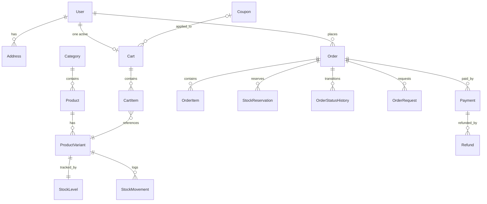

# Domain model

All monetary amounts are **net (excluding VAT)** unless a field name says otherwise; the UI
displays both net totals and VAT. Currency is **EUR** only. Timestamps are stored in UTC.

## 1. Conventions

- **Money** is a value object: `Decimal` with 2 decimal places, `ROUND_HALF_UP`, EUR.
  Persisted as **integer cents** (SQLite has no exact decimal type; a custom column type
  converts cents ↔ `Decimal`). Rates are stored as basis points the same way. Arithmetic
  on raw floats is forbidden in domain code.
- **VAT**: each product carries a `vat_rate` (default **23 %**, the Slovak standard rate,
  configurable via settings). VAT is computed per order line from net amounts and rounded
  per line, then summed.
- **Quantities** are positive integers.
- **Soft deactivation** (`is_active=false`) is used instead of deleting products, variants,
  users, and coupons, so history stays consistent.
- Primary keys are integer autoincrement; unique business keys (SKU, coupon code, order
  number, e-mail) have unique constraints.

## 2. Entity catalog

### Users & access

| Entity | Key fields | Notes |
|---|---|---|
| **User** | `email` (unique), `password_hash`, `full_name`, `role`, `is_active` | `role ∈ {customer, warehouse_staff, administrator, support_agent}` — single role per user |
| **Address** | `user_id`, `label`, `street`, `city`, `zip`, `country`, `is_default` | Customer-owned; orders copy address fields as a snapshot |

### Catalog

| Entity | Key fields | Notes |
|---|---|---|
| **Category** | `name`, `slug` (unique), `description`, `is_active` | Flat list (no hierarchy) |
| **Product** | `category_id`, `name`, `slug` (unique), `description`, `brand`, `base_price` (net), `vat_rate`, `is_active` | Searchable by name/brand |
| **ProductVariant** | `product_id`, `sku` (unique), `name`, `attributes_json` (e.g. color, capacity), `price_delta` (net, may be negative), `is_active` | Effective unit price = `product.base_price + variant.price_delta`, must be > 0 |

Rules:

- An inactive product, inactive variant, or a variant of an inactive product/category can
  never be added to a cart or ordered (`ProductActivationPolicy`,
  `VariantAvailabilityPolicy`). Existing orders keep their snapshots.

### Inventory

| Entity | Key fields | Notes |
|---|---|---|
| **StockLevel** | `variant_id` (unique), `on_hand`, `reserved`, `low_stock_threshold` | `available` is derived, never stored |
| **StockMovement** | `variant_id`, `movement_type`, `quantity` (signed), `reason`, `reference` (e.g. order number), `actor_user_id`, `created_at` | Types: `receipt`, `adjustment`, `reservation`, `release`, `shipment`, `return`, `import` |
| **StockReservation** | `order_id`, `variant_id`, `quantity`, `status` | `status ∈ {active, released, consumed}` |

**Invariants** (enforced in `InventoryService` and checked by tests):

```text
available = on_hand - reserved
on_hand   >= 0
reserved  >= 0
available >= 0
a new reservation must not exceed the current available quantity
```

- Reserving stock increases `reserved` (movement `reservation`, negative available).
- Releasing (payment failed, cancellation) decreases `reserved` (movement `release`).
- Shipping consumes the reservation: `on_hand -= q`, `reserved -= q` (movement `shipment`).
- A return receipt increases `on_hand` (movement `return`).
- Manual adjustments (admin/warehouse) require a non-empty `reason` and write a movement.
- `LowStockPolicy`: variant is low-stock when `available <= low_stock_threshold`
  (threshold per variant, with a global default from settings).

### Cart & pricing

| Entity | Key fields | Notes |
|---|---|---|
| **Cart** | `customer_id`, `status`, `coupon_code` (nullable), `updated_at` | Exactly one `active` cart per customer; checkout converts it |
| **CartItem** | `cart_id`, `variant_id` (unique together), `quantity` | Quantity capped by current availability and a per-line max (settings) |
| **Coupon** | `code` (unique, case-insensitive), `discount_type` (`percent`/`fixed`), `value`, `valid_from`, `valid_until`, `min_cart_total`, `max_uses`, `used_count`, `category_id` (nullable), `is_active` | `used_count` increments only on successful checkout |

**Pricing pipeline** (server-side only; `CartPriceCalculator` / `PricingService`):

```text
line_net        = effective_unit_price × quantity
subtotal        = Σ line_net
discount        = coupon applied to eligible lines (see below), never > eligible subtotal
discounted_net  = subtotal - discount
line_vat        = (line_net - line_discount_share) × vat_rate   (rounded per line)
vat_total       = Σ line_vat
grand_total     = discounted_net + vat_total
```

Coupon rules (`CouponValidator`, `CouponEligibilityPolicy`, `DiscountCalculator`):

- must be active, within `valid_from..valid_until`, `used_count < max_uses`;
- `min_cart_total` compares against the **net subtotal of eligible lines**;
- if `category_id` is set, only lines from that category are eligible and discounted;
- `percent` discounts apply to the eligible subtotal; `fixed` discounts are capped at the
  eligible subtotal and allocated across eligible lines proportionally (largest-remainder
  rounding so the allocated parts sum exactly to the discount).

### Orders

| Entity | Key fields | Notes |
|---|---|---|
| **Order** | `order_number` (unique, e.g. `AF-2026-000123`), `customer_id`, `status`, `subtotal`, `discount_total`, `vat_total`, `grand_total`, `coupon_code`, address snapshot fields, `created_at`, `updated_at` | Status per [order-state-machine.md](order-state-machine.md) |
| **OrderItem** | `order_id`, `variant_id`, `product_name`, `sku`, `unit_price`, `vat_rate`, `quantity`, `discount_amount`, `vat_amount`, `line_total` | Full snapshot at checkout time — later catalog changes never affect it |
| **OrderStatusHistory** | `order_id`, `from_status`, `to_status`, `event`, `actor_user_id`, `note`, `created_at` | Written on every transition |
| **OrderRequest** | `order_id`, `request_type` (`cancel`/`return`), `reason`, `status` (`pending`/`approved`/`rejected`), `requested_by`, `decided_by`, `created_at`, `decided_at` | Work queue for SupportAgent |

### Payments

| Entity | Key fields | Notes |
|---|---|---|
| **Payment** | `order_id`, `amount`, `status` (`pending`/`authorized`/`declined`/`timeout`/`refunded`), `payment_token`, `idempotency_key` (unique), `gateway_reference`, `created_at`, `updated_at` | One logical payment per order attempt; callbacks are idempotent on `idempotency_key` |
| **Refund** | `payment_id`, `amount`, `reason`, `status` (`pending`/`completed`), `created_at` | Created by cancellation of a paid order or an approved return |

The **payment token** submitted at checkout deterministically selects the simulated
outcome (e.g. `tok-success`, `tok-declined`, `tok-timeout`); see the payment adapter
documentation in [api-overview.md](api-overview.md) once implemented. No randomness.

### Platform

| Entity | Key fields | Notes |
|---|---|---|
| **Notification** | `recipient_user_id`, `notification_type`, `subject`, `body`, `payload_json`, `status`, `created_at` | Outbox — nothing is sent externally |
| **AuditLogEntry** | `actor_user_id` (nullable for system), `action`, `entity_type`, `entity_id`, `details_json`, `created_at` | Append-only; written for order creation, payment results, reservation/release, state changes, refunds, stock adjustments, admin changes, denied access where relevant |

## 3. Relationships (overview)



## 4. Authorization matrix (object level)

| Resource | customer | warehouse_staff | support_agent | administrator |
|---|---|---|---|---|
| Active catalog (read) | ✔ | ✔ | ✔ | ✔ |
| Own cart (read/write) | ✔ | — | — | — |
| Own orders (read, cancel in allowed states, return request) | ✔ | — | — | ✔ (read) |
| All orders (read) | — | ✔ (fulfillment states) | ✔ | ✔ |
| Order fulfillment transitions | — | ✔ | — | ✔ |
| Cancel/refund request decisions | — | — | ✔ | ✔ |
| Stock adjustments (with reason) | — | ✔ | — | ✔ |
| Prices, products, coupons, users, imports, reports, audit log | — | — | — | ✔ |

Denied operations must fail with the consistent 403 envelope and are intended targets for
horizontal/vertical access tests.
