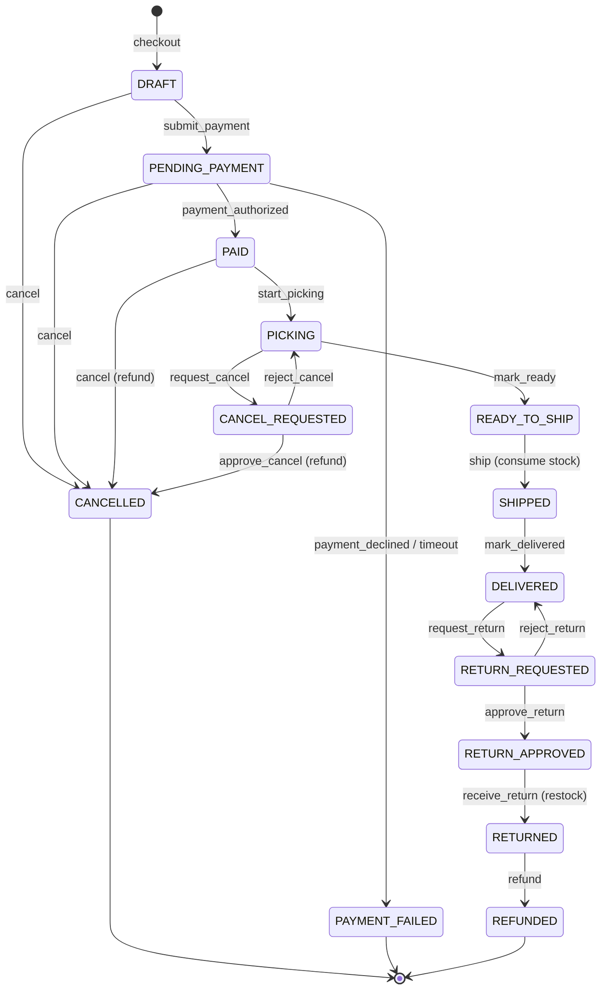

# Order state machine

Every order status change goes through `OrderStateMachine.transition(order, event, actor)`,
which validates the **current state**, the **event**, and the **actor's role**, executes the
transition's side effects inside the calling use case's transaction, appends an
`OrderStatusHistory` row, and writes an `AuditLogEntry`. Any disallowed combination raises
`InvalidStateTransition` → HTTP 409 with code `invalid_state_transition`.

## 1. States

| State | Meaning |
|---|---|
| `DRAFT` | Order created from the cart during checkout; not yet submitted for payment |
| `PENDING_PAYMENT` | Stock reserved, waiting for the (simulated) payment result |
| `PAID` | Payment authorized; waiting for the warehouse |
| `PICKING` | Warehouse is picking the items |
| `READY_TO_SHIP` | Picked and packed, waiting for dispatch |
| `SHIPPED` | Handed to (simulated) carrier; stock consumed |
| `DELIVERED` | Confirmed delivered |
| `CANCELLED` | Terminated before shipment; reservation released, paid amounts refunded |
| `PAYMENT_FAILED` | Payment declined or timed out; reservation released (terminal) |
| `CANCEL_REQUESTED` | Customer asked to cancel while picking was already running |
| `RETURN_REQUESTED` | Customer asked to return a delivered order |
| `RETURN_APPROVED` | Support approved the return; waiting for goods |
| `RETURNED` | Goods received back into stock |
| `REFUNDED` | Money returned for a completed return (terminal) |

Terminal states: `DELIVERED`*, `CANCELLED`, `PAYMENT_FAILED`, `REFUNDED`
(*`DELIVERED` can still branch into the return flow).

## 2. Transition table

Roles: **C** = customer (owner only), **W** = warehouse_staff, **S** = support_agent,
**A** = administrator, **sys** = system (payment callback processing).

| # | From | Event | To | Allowed | Guards & side effects |
|---|---|---|---|---|---|
| 1 | `DRAFT` | `submit_payment` | `PENDING_PAYMENT` | sys (checkout use case) | Stock reserved for all items; payment record created; notification `order_created` |
| 2 | `DRAFT` | `cancel` | `CANCELLED` | C, A, sys | E.g. reservation failed mid-checkout; releases any partial reservation |
| 3 | `PENDING_PAYMENT` | `payment_authorized` | `PAID` | sys | Payment → `authorized`; coupon `used_count` incremented; notification `payment_confirmed` |
| 4 | `PENDING_PAYMENT` | `payment_declined` | `PAYMENT_FAILED` | sys | Payment → `declined`; **reservation released**; notification `payment_failed` |
| 5 | `PENDING_PAYMENT` | `payment_timeout` | `PAYMENT_FAILED` | sys | Payment → `timeout`; **reservation released**; notification `payment_failed` |
| 6 | `PENDING_PAYMENT` | `cancel` | `CANCELLED` | C, S, A | Reservation released; pending payment voided |
| 7 | `PAID` | `start_picking` | `PICKING` | W, A | Order enters warehouse queue history |
| 8 | `PAID` | `cancel` | `CANCELLED` | C, S, A | **Refund created** for the authorized payment; reservation released; notification `order_cancelled` |
| 9 | `PICKING` | `request_cancel` | `CANCEL_REQUESTED` | C | Creates a pending `OrderRequest(cancel)`; picking is paused logically |
| 10 | `CANCEL_REQUESTED` | `approve_cancel` | `CANCELLED` | S, A | Request → approved; refund created; reservation released |
| 11 | `CANCEL_REQUESTED` | `reject_cancel` | `PICKING` | S, A | Request → rejected; picking resumes |
| 12 | `PICKING` | `mark_ready` | `READY_TO_SHIP` | W, A | — |
| 13 | `READY_TO_SHIP` | `ship` | `SHIPPED` | W, A | **Reservation consumed**: `on_hand -= q`, `reserved -= q`, movement `shipment`; notification `order_shipped` |
| 14 | `SHIPPED` | `mark_delivered` | `DELIVERED` | W, A | Simulated carrier confirmation; notification `order_delivered` |
| 15 | `DELIVERED` | `request_return` | `RETURN_REQUESTED` | C | Guard: `ReturnEligibilityPolicy` — within the return window (default 14 days from delivery) |
| 16 | `RETURN_REQUESTED` | `approve_return` | `RETURN_APPROVED` | S, A | Request → approved; notification with return instructions |
| 17 | `RETURN_REQUESTED` | `reject_return` | `DELIVERED` | S, A | Request → rejected |
| 18 | `RETURN_APPROVED` | `receive_return` | `RETURNED` | W, A | Goods back: `on_hand += q`, movement `return` |
| 19 | `RETURNED` | `refund` | `REFUNDED` | S, A | Refund created/completed for the payment; notification `refund_completed` |

Everything not listed is forbidden — including "skipping" states (e.g. `PAID → SHIPPED`)
and any transition by a role not listed for it. A customer can act only on **their own**
order (ownership is checked before role rules).

Note on rejected returns (#17): the order returns to `DELIVERED`; the return window keeps
counting from the original delivery time.

## 3. Diagram

## 4. Stock ↔ state coupling (summary)

| Moment | Stock effect |
|---|---|
| `DRAFT → PENDING_PAYMENT` | `reserved += q` per item (guard: `q ≤ available`) |
| `→ PAYMENT_FAILED` or any `→ CANCELLED` before shipment | `reserved -= q` (release) |
| `READY_TO_SHIP → SHIPPED` | `on_hand -= q`, `reserved -= q` (consume) |
| `RETURN_APPROVED → RETURNED` | `on_hand += q` (restock) |

These couplings are what BG-02 and BG-05 in
[business-goals-and-acceptance.md](business-goals-and-acceptance.md) protect.

## 5. Idempotency of payment callbacks

The simulated gateway calls back with an `idempotency_key`. Processing the same key twice
must not: create a second payment, transition the order twice, duplicate notifications, or
duplicate stock movements. A replayed callback returns the original outcome without new
side effects. This rule is a first-class test target (integration scenario 4).
